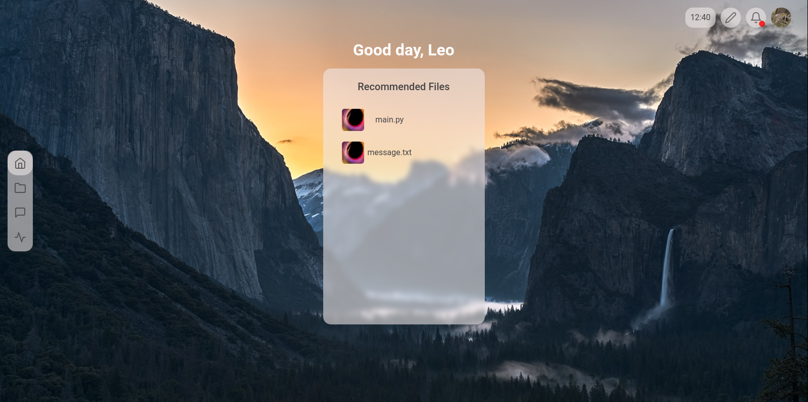

# Cloud9 ☁️

Your data, on cloud 9.

## What makes it so special? 🤩

- 📁 **Store your data** ..in one place
- 🔄 **Sync your data** .., appointments and more
- 🔐 **Secure your data** ..without compromise
- 👏 **Share your data** ..with your friends
- 😄 **Enjoy a beautiful handmade user interface**
- 😉 **We do not collect any data from you.**
## Is there a destination?

This project was born solely out of the desperation that arose during the effort of setting up with other cloud providers. My goal is to make sure that anyone who wants to set up their own cloud instance doesn't have that path filled with rocks. This project is undoubtedly a mammoth task. However, regular updates are planned for both the user interface, the user experience, and most importantly, security. 

## About inspiration, motivation and more
The inspiration, as mentioned above, was drawn mainly from the poor implementations of the alternatives.
The motivation of this project does not come from anywhere. Mainly, from people I like very much. First and foremost, my girlfriend ❤️, who has significantly motivated me to this project.

